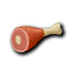
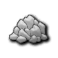
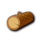

# Create NLP Model

For build order use images

# 5 


```djangourlpath
5 Food       5 Stone    5 Wood      5 Gold 
```






# Create images for the required
Also get the buildings that you are required to build
- Make it so you can tick off buildings
- The ticked buildings will mean you have a target for:
  - 500 stone...
  - 400 gold , 800 food
- If you can make AI that reads your resource count
The resource count AI will calculate rates required to gain resources

Requires stats for 
:Resource/villager [Per resource: Gold,stone,food,wood]
    - This will be based on the upgrades
    - Could try and find the most efficient path e.g TH and stuff late game.